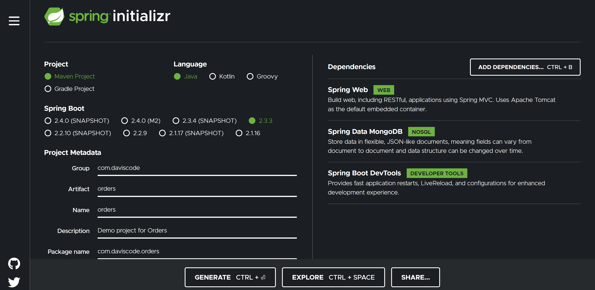
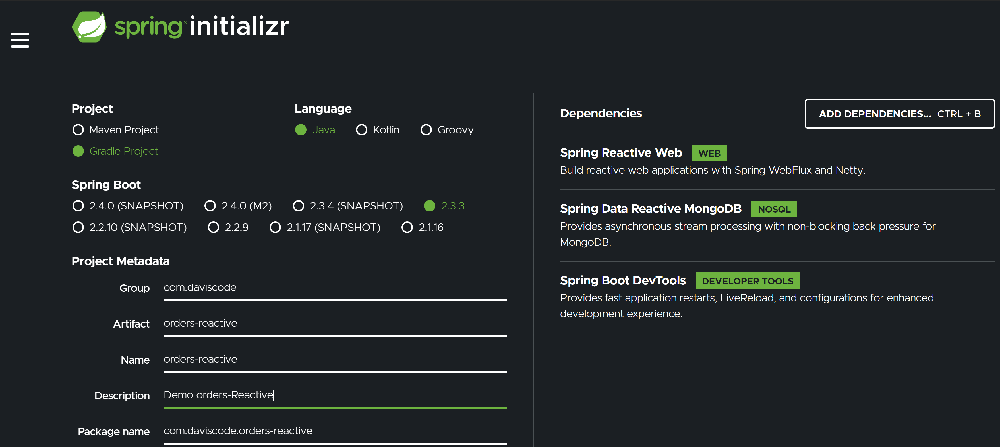
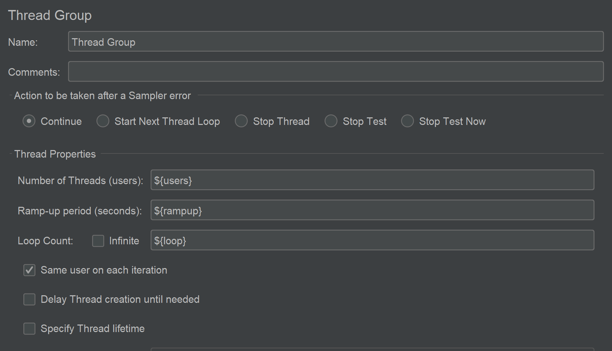
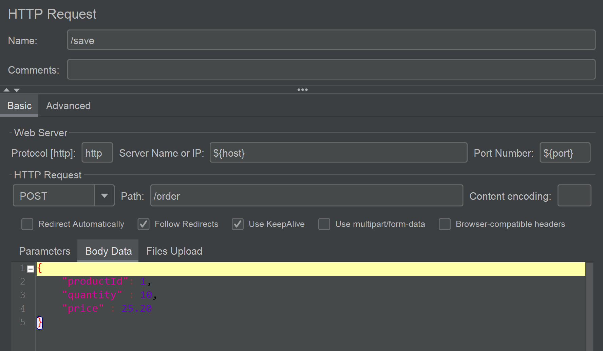
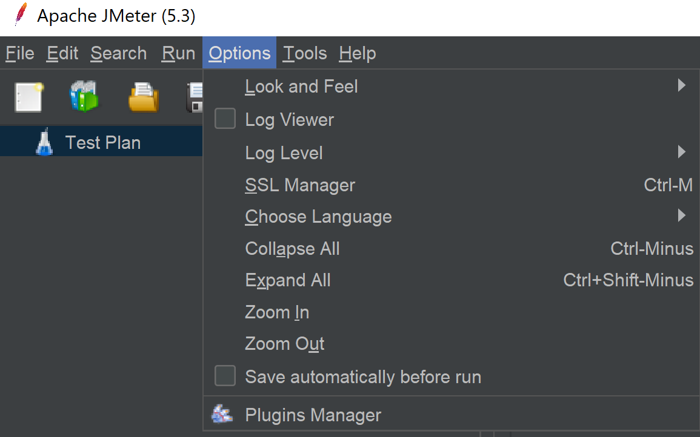
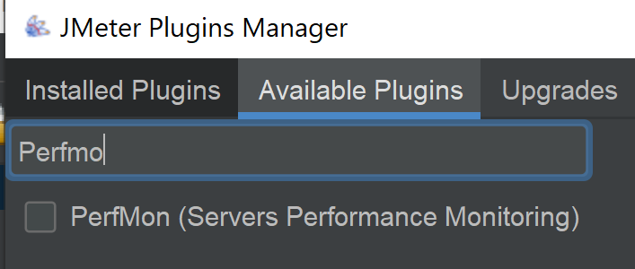
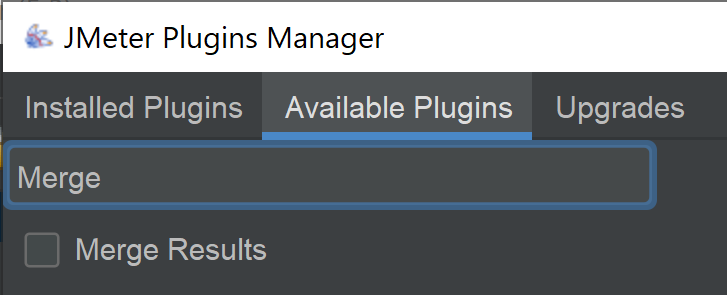
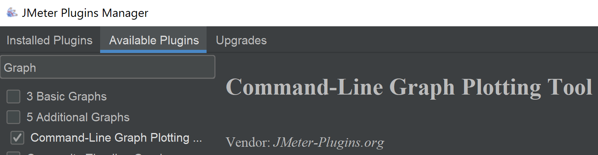
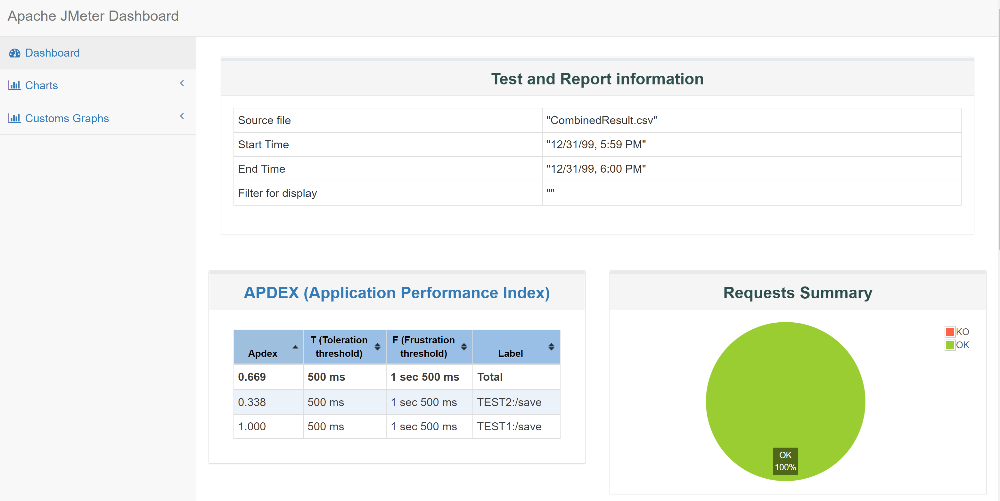
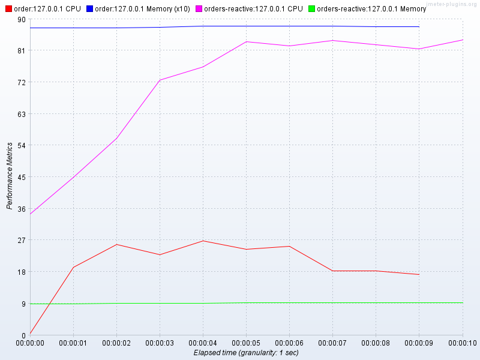

# Spring Reactive Application vs Non-Reactive Performance Test

In this oportunity we show a way to make performance test between two applications. We use JMeter to compare the performace between Spring Boot REST Apps. One with Reactive Stack and with Non-Reactive Stack. Also we use Docker-compose to our test stack. 


## Requeriments
- JAVA 11
- JAVA_HOME in your environment
- Docker version 19.03.
- Docker-compose version 1.27
- [Apache JMeter 5.3](https://downloads.apache.org//jmeter/binaries/apache-jmeter-5.3.zip)
- Two Spring boots Apps (orders , orders-reactive).You use any that expose REST.
Orders Configuration

Orders Reactive Configuration


## Step 1 - Define Parameters and Variables in JMeter 
- Before run the script we did create some parameters in JMeter with default values and associate Ex: **${__P(host,localhost)}** to variables names **host**. 
- This variable are in test-plan.jmx

- We use JMeter Variables in Thread Group and Http Resquest


## Step 5 - Add Plugins To JMeter

-  Download Plugin Manager from https://jmeter-plugins.org/get/
- Put jmeter-plugins-manager-1.4.jar  apache-jmeter-5.3/lib/ext
- Then Restart 

- Install PerfMon Plugin to get CPU and RAM statistics

- Install Merge Results Plugin to merge result files

- Install  Command-Line Graph Plotting Tool Plugin to merge result files


## Step 6 - Compile
- First we run compile both, we have to run next command to build /order 
````sh 
./gradlew build
````
## Step 7  - Run Containers
- Execute
````sh 
docker-compose up -d
````

## Step 8 - Execute JMeter and Save Results
- Run JMeter and save the results. Go to apache-jmeter-5.3/bin and then execute

Parameters Description
In the Options menu you see Enable PluginsManager Option
````
-n => Jmeter with non-gui
-t => Path of script JMX 
-l => Output result file 
-e => generate report dashboard after load test
-o => Output folder of reports dashboard
````
List of all command line options
https://jmeter.apache.org/usermanual/get-started.html#options

For the first app run:
````sh 
./jmeter.bat -n -t test-plan.jmx -l result.jtl -e -o ./HTMLReport -Jhost=localhost -Jport=8080 -Jusers=10 -Jrampup=10 -Jloop=2 -Jperfmonport=4444 -Jtestname=orders
````

And for the second app then execute jmeter

````sh 
./jmeter.bat -n -t test-plan.jmx -l result2.jtl -e -o ./HTMLReport2 -Jhost=localhost -Jport=8090 -Jusers=10 -Jrampup=10 -Jloop=2 -Jperfmonport=4445 -Jtestname=ordersreactive
````
## Step 9 - Merge Results

Before you need create properties file in apache-jmeter-5.3/bin/merge-results.properties with a configuration like this
````
inputJtl1=result.csv
prefixLabel1=TEST1:

inputJtl2=result2.csv
prefixLabel2=TEST2:
````
and apache-jmeter-5.3/bin/merge-perf.properties with a configuration like this
````
inputJtl1=orders-perf.csv
prefixLabel1=TEST1:

inputJtl2=ordersreactive-perf.csv
prefixLabel2=TEST2:
````

Then go to apache-jmeter-5.3/bin and Run Merge command to combine the results
````sh
./JMeterPluginsCMD.bat --tool Reporter --generate-csv CombinedResult.csv --input-jtl merge-results.properties --plugin-type MergeResults
````

````sh
./JMeterPluginsCMD.bat --tool Reporter --generate-csv CombinedPerf.csv --input-jtl merge-perf.properties --plugin-type MergeResults
````

## Step 10 - Generate Dashboard Report
Generate report of CombinedResult.jtl
````sh
./jmeter.bat -g CombinedResult.csv -o ./HTMLReportCombined
````

## Step 11 - Merge Results
````sh
./JMeterPluginsCMD.bat --generate-png test-perf.png --input-jtl CombinedPerf.csv --plugin-type PerfMon --width 800 --height 600
````


## Step 12 - View Results Files
HTMLReportCombined/index.html

test-perf.png


## Links
JMeter Plugin Manager - https://jmeter-plugins.org/wiki/PluginsManager/

JMeter Merge Results -
https://jmeter-plugins.org/wiki/JMeterPluginsCMD/
https://jmeter-plugins.org/wiki/MergeResults/
